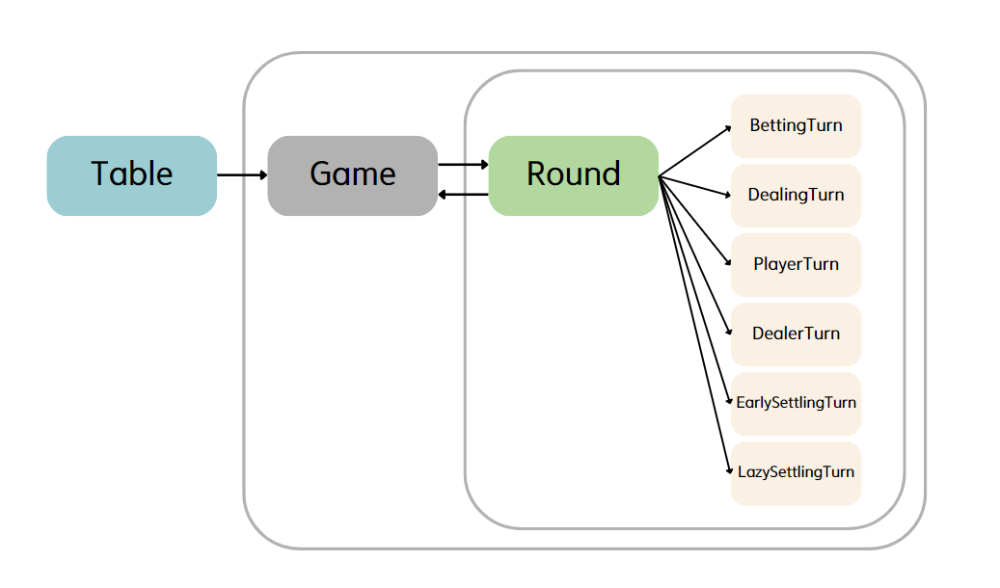
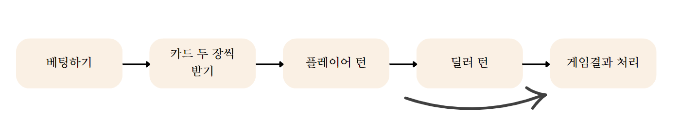
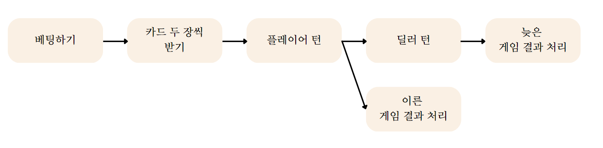
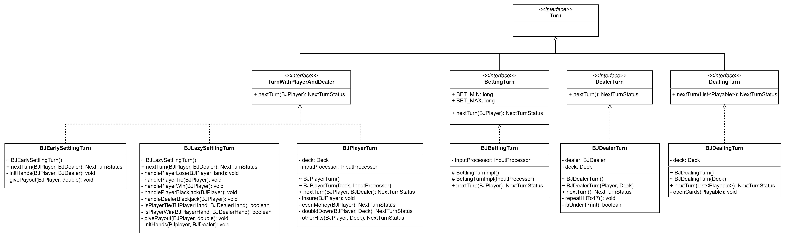
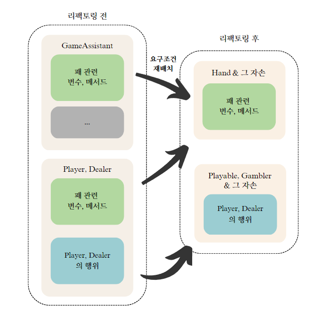
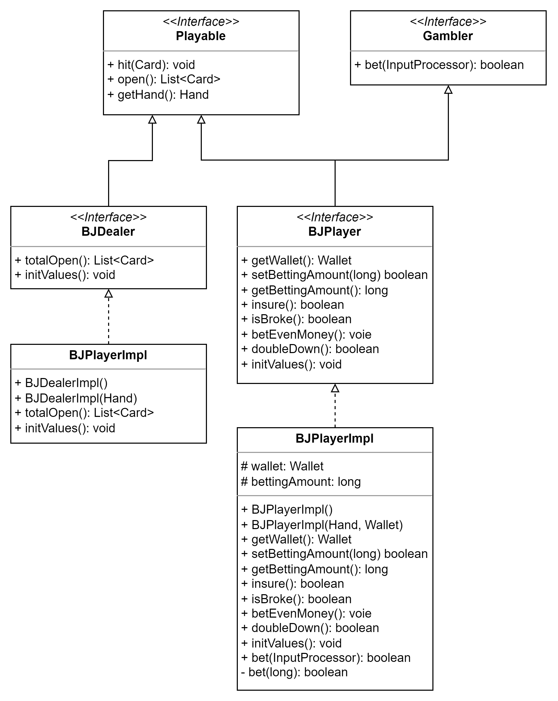
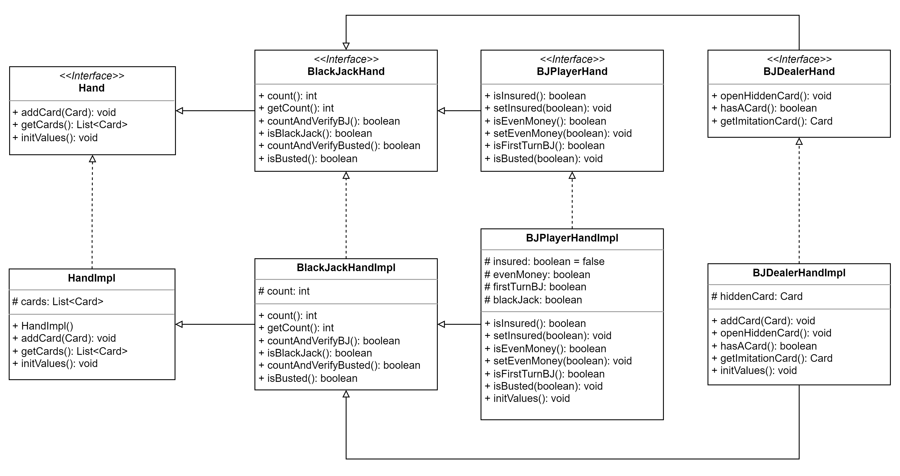

# Blackjack game

## 목차
1. [introduction](#introduction)
2. [Game Rules](#game-rules)
3. [구현](#구현)
   1. [구현 과정](#구현-과정) 
   2. [class와 interface의 목록과 기능](#class와-interface의-목록과-기능)
   3. [Game 인터페이스의 역할](#Game-인터페이스의-역할)
   4. [Round와 Turn](#Round와-Turn)
   5. [추상화와 중복코드 제거](#추상화와-중복코드-제거)

***
## introduction
이 Blackjack 게임은
- 객체지향에 대해 배우기위해 만들기 시작한 블랙잭 게임입니다.
- **콘솔**로 조작합니다
  - **객체지향**에대해 공부하는 것이 목표였기 때문에 화면을 구현하지 않았습니다
- 플레이어와 딜러가 **1:1 승부**하는 형식입니다
- [이전의 블랙잭 게임 구현](https://github.com/HyeKyungAhn/BlackJackGame) 을 리팩토링한 결과물입니다
- 추후 인터페이스를 재활용하여 다른 카드게임을 구현할 목적으로 설계했습니다

## Game Rules

이 게임에서 구현된 규칙들은 다음과 같습니다.

- Blackjack
    - 각 카드에는 점수가 있습니다
      - A 카드는 1점 또는 11점
      - J,Q,K는 10점 그 외의 카드는 카드의 숫자와 동일
    - 카드가 21점이 되면 Blackjack입니다

- Hit
  - 카드 한 장 받기

- Insurance
  - 보여지는 딜러 카드가 A일 때 베팅 금액의 반을 보험금으로 지불 가능
  - 딜러가 블랙잭일 때 보험수당으로 보험금의 2배를 수령

- Even money
  - 플레이어의 카드가 Blackjack이고 딜러의 오픈된 카드가 A일 때 선택 가능
  - 선택 시, 베팅한 금액과 동일한 금액을 승리수당으로 받고 게임 즉시 종료
  - 미 선택 시, 게임 계속 진행

- double down
  - 카드를 한 장만 더 받는 조건으로 돈을 두 배로 걸 수 있다

- stand
  - 카드를 더 뽑지 않고 멈추는 것
  - 카드의 합이 21이 넘지 않는 이상 언제든 멈출 수 있다

- push
  - 플레이어와 딜러가 무승부인 경우 배팅액을 돌려받는다

* split과 surender는 추후 구현 예정

자세한 블랙잭 규칙들은 [나무위키(블랙잭 게임)](https://namu.wiki/w/%EB%B8%94%EB%9E%99%EC%9E%AD(%EC%B9%B4%EB%93%9C%EA%B2%8C%EC%9E%84))
을 참고해주세요.

## 구현

### class와 interface의 목록과 기능

<details>
<summary>interface</summary>

| 이름                      | 기능                                        |
|-------------------------|-------------------------------------------|
| Game                    | 게임 실행 관련 추상메서드 정의한 인터페이스                  |
| Round                   | 게임 라운드 실행과 종료, 게임 흐름 진행 관련 인터페이스          |
| Turn                    | 게임의 각 단계를 연관짓는 인터페이스                      |
| BettingTurn             | 게임의 베팅 관련 추상메서드 정의한 인터페이스                 |
| DealingTurn             | 게임의 딜링 관련 추상메서드 정의한 인터페이스                 |
| DealerTurn              | 게임의 딜러 턴 관련 추상메서드 정의한 인터페이스               |
| TurnWithPlayerAndDealer | 플레이어와 딜러 객체가 모두 필요한 턴의 관련 추상메서드 정의한 인터페이스 |
| Playable                | 게임에 참여하는 액터의 행위를 정의                       |
| Gambler                 | 베팅에 참여할 수 있는 액터의 행위를 정의                   |
| BJDealer                | 블랙잭 게임의 딜러 관련 인터페이스                       |
| BJPlayer                | 블랙잭 게임의 플레이어 관련 인터페이스                     |
| Hand                    | 게임의 패 관련 추상 메서드가 정의된 인터페이스                |
| BlackJackHand           | 블랙잭 게임의 패 관련 추상메서드가 정의된 인터페이스             |
| BJPlayerHand            | 블랙잭 게임의 플레이어 패 관련 추상메서드가 정의된 인터페이스        |
| BJDealerHand            | 블랙잭 게임의 딜러 패 관련 추상메서드가 정의된 인터페이스          |
| Viewer                  | 정보를 콘솔에 출력하기 위한 메서드 정의한 인터페이스             |
| InputProcessor          | 사용자의 입력값을 받아 처리하는 기능의 추상 메서드를 정의한 인터페이스   |
| InputValidator          | 입력값 검증 관련 static 메서드 정의한 인터페이스            |
| Wallet                  | 플레이어의 돈과 관뎐된 추상 메서드를 정의한 인터페이스            |
</details>

<details>
<summary>class</summary>

| 이름                | 기능                                         |
|-------------------|--------------------------------------------|
| Table             | 애플리케이션 실행 클래스                              |
| BlackJackGame     | Game 인터페이스 구현 클래스, 블랙잭 게임 실행과 종료 구현        |
| BlackJackRound    | 블랙잭 게임의 라운드 실행 종료, 실제적인 게임 흐름을 제어하는 클래스    |
| BJBettingTurn     | 블랙잭 게임의 베팅 단계를 실행하는 클래스                    |
| DealingTurn       | 카드 패를 나눠주는 딜링 단계를 실행하는 클래스                 |
| BJPlayerTurn      | 블랙잭 게임 플레이어의 선택에 따른 게임의 흐름을 제어하는 클래스       |
| BJDealerTurn      | 블랙잭 게임 딜러의 패를 처리하는 클래스                     |
| EarlySettlingTurn | 이르게 게임이 완료된 경우 게임의 결과를 처리 하는 클래스           |
| LazySettlingTurn  | DealerTurn 이후 최종적으로 게임의 결과를 처리하는 클래스       |
| BJDealerImpl      | 블랙잭 게임의 딜러의 데이터와 행동의 정의되어있는 클래스            |
| BJPlayerImpl      | 블랙잭 게임의 플레이어의 데이터와 행동이 정의된 클래스             |
| HandImpl          | 게임 플레이어가가 가진 패에 대한 정보를 저장하고 처리하는 클래스       |
| BlackJackHandImpl | 블랙잭 게임 참가자의 패에 대한 정보를 저장하고 처리하는 클래스        |
| BJPlayerHandImpl  | 블랙잭 게임 플레이어가 가진 패에 대한 정보를 저장하고 처리하는 클래스    |
| BJDealerHandImpl  | 블랙잭 게임 딜러가 가진 패에 대한 정보를 저장하고 처리하는 클래스      |
| Card              | 플레잉 카드, Card에 대한 정보 저장 및 행동 정의             |
| Deck              | Card 객체와 Deck과 관련된 행동 정의                   |
| BJInputProcessor  | 블랙잭 게임 사용자의 입력을 받아 검증 후 입력값을 가공하여 반환하는 클래스 |
| VirtualWallet     | 플레이어의 돈과 관뎐된 데이터를 저장 및 처리하는 클래스            |
</details>

### 구현 과정
애플리케이션의 전체적인 흐름입니다.

<div align="center">

<div>[그림1]</div>
</div>
[그림1]

### Game 인터페이스의 역할

블랙잭 게임을 구현하는데 사용한 인터페이스, 클래스들은 추후 다른 게임을 구현할 때 재사용하기 위한 목적을 가지고 구현했습니다.
따라서 게임을 실행하는 Table 클래스와 실질적으로 게임을 진행하는 인터페이스인 Round 사이에 각 게임을 실행 및 종료하는 Game 인터페이스가 
위치해있습니다.

### Round와 Turn

이 게임을 구현하는데 가장 어려웠던 것 중 하나는 **게임의 흐름을 제어**하는 부분이었습니다.
블랙잭 게임은 초기에 플레이어와 딜러가 받는 패에 따라 게임이 조기에 종료될 수도, 마지막 단계까지 거쳐 종료될 수도 있는
게임입니다.

<div align="center">

<div>[그림2]</div>
</div>
[그림2]

#### 리팩토링 이전
[리팩토링 이전(코드)](https://github.com/HyeKyungAhn/BlackJackGame/blob/master/src/Game.java) 에는 Game 클래스에서
playerTurn, dealerTurn 메서드를 생성하여 그 메서드에서 흐름을 제어했습니다. 게임의 결과 처리도 각 턴 메서드에서 처리를 하도록 했습니다.
```java
// 리팩토링 이전의 코드
public class Game{
    
    public void play(){
        //...
        do {
            if(ga.initSet(ga, deck, player, dealer)==FINISH_GAME){ break; }
            if(playerTurn(ga, deck, player, dealer,  scan)==FINISH_ROUND){ continue; }
            dealerTurn(ga, deck, dealer, player);
        } while(anotherGame(player, scan));
    }
}
```

하지만 한 클래스가 플레이어와 딜러의 게임 흐름 제어 그리고 게임 결과에 따른 후처리 메서드 호출(+ 입력값 처리)이라는 많은 관심사를 가지게되어
객체지향의 단일 책임 원칙을 위배한 것을 볼 수 있습니다. 

또 개인적으로 게임 결과를 처리하는 것은 게임 흐름([그림2])에서 큰 부분을 차지한다고 생각하는데, 단순히 playerTurn, dealerTurn 메서드에서
다른 클래스(GameAssistant)에 정의된 게임 결과 처리 메서드를 직접 호출하는 것은 처음에 생각한 애플리케이션의 구조와는 맞지 않았습니다. 

이에 대한 해결법을 찾는 도중, mysticfall님의 [Scala로 구현한 블랙잭 게임 예제](https://github.com/mysticfall/card-game-example)
에서 힌트를 얻고, 이 프로젝트에 맞게끔 수정하여 Round와 Turn의 구조를 도입했습니다.

#### 리팩토링 후

<div align="center">

<div>[그림3]</div>
</div>


먼저 [그림2]의 블랙잭 게임의 단계를 [그림3]과 같이 나누었습니다. 특정 패일 때만 이르게 게임 결과를 처리하기 때문에
결과 처리를 **'이른 게임결과처리'와 '늦은 게임결과처리', 두 단계로 나눌** 수 있었습니다.

<div align="center">

<div>[그림4]</div>
</div>

그리고 각 단계를 Turn 인터페이스를 구현하는 클래스들로 위와 같이 구현했습니다.
Turn의 자손 인터페이스를 구현할때 가장 중점적으로 생각한 것은 다음과 같습니다.  
- **하나의 관심사만**을 가지는 클래스를 정의
- 게임의 6 단계를 모두 Turn을 구현하는 클래스로 작성하여 **원래 구상한 애플리케이션 구조에 맞게 구현**
- 확장성을 생각하여 구현 (static > 추상메서드)
- 인터페이스 분리원칙 지키기

```java
//리팩토링 후
public class BlackJackRound implements Round {
  private NextTurnStatus nextTurn = NextTurnStatus.INITIAL;

  boolean isFinal = false;
  //...

  @Override
  public void next() {

    do {
      process();
    } while (nextTurn != NextTurnStatus.FINISH_TURN);

    //...

    if(!(isFinal = inputProcessor.getBooleanAnswer())){
      nextTurn =  NextTurnStatus.INITIAL;
    }
  }
  
  @Override
  public void process() {
    switch (nextTurn) {
      case INITIAL: {
        nextTurn = NextTurnStatus.BETTING_TURN;
      }
      break;

      case BETTING_TURN: {
        nextTurn = bettingTurn.nextTurn(player);
      }
      break;

      case DEALING_TURN: {
        nextTurn = dealingTurn.nextTurn(playerAndDealer);
      }
      break;

      case PLAYER_TURN: {
        nextTurn = playerTurn.nextTurn(player, dealer);
      }
      break;

      case DEALER_TURN: {
        nextTurn = dealerTurn.nextTurn();
      }
      break;

      case EARLY_SETTLING_TURN: {
        nextTurn = earlySettlingTurn.nextTurn(player, dealer);
      }
      break;

      case LAZY_SETTLING_TURN: {
        nextTurn = lazySettlingTurn.nextTurn(player, dealer);
      }
      break;
    }
  }
}
```

마지막으로 **Round 인터페이스를 구현**했습니다. 각 턴을 게임 결과에 따라 다음 턴에 해당하는 NextTurnStatus enum을 반환하도록
작성했기 때문에 한 라운드가 끝날때까지 반복문으로 process()를 호출하여 게임의 단계를 진행할 수 있도록 구현했습니다.

### 추상화와 중복코드 제거

중복코드를 방지하고 객체지향의 의존 역전의 법칙을 지키기 위해 클래스들을 관심사 별로 세분화하고 인터페이스로 추상화하는 과정을 거쳤습니다.
이 과정이 두드러져보이는 객체는 바로 Player, Dealer입니다.

#### 리팩토링 전

<div align="center">

<div>[그림5]</div>
</div>

Role이라는 추상 클래스를 상속받아 플레이어와 딜러를 구현했습니다. 하지만 여기에는 몇가지 **문제점**이 있습니다.

1. 플레이어 클래스 내에 **패와 관련된** 상태를 저장 및 처리하는 **변수와 메서드가 대부분**(관심사 분리 필요)
2. Player와 Dealer 내에 메서드 **구현부가 동일한 것과 동일하지 않은 것이 혼재**(중복 코드 제거 필요)
3. Role은 상속 및 확장이 목표가 아니라, **구현 클래스의 행위를 보장**하는 것이 목표(인터페이스 사용 필요)

#### 리팩토링 후

위의 문제점을 해결하기 위해 먼저 **도메인의 핵심 개념을 재파악**한 후 인터페이스를 생성하고 **요구 조건들을 재배치**했습니다.
(1, 3번 문제 해결)

| 인터페이스 이름 | 설명                    |
|:---------|:----------------------|
| Playable | 테이블에서 게임에 참여할 수 있음    |
| Gambler  | 테이블에서 베팅할 수 있음        |
| Hand     | 카드 패와 관련된 정보를 저장 & 처리 |


<div align="center">

<div>[그림6]</div>
</div>

그 다음, **중복코드를 제거**하고 객체 간 상호작용 시 **추상화에 의존**하기 위해서
**상속과 구현을 함께 사용**하여 클래스들을 구현했습니다. (2번 문제 해결)

이제까지 Spring MVC에서 사용하던 ...Impl클래스의 사용 이유를 이해할 수 있는 경험이었습니다.
아래는 리팩토링 후의 결과물입니다.

<div align="center">

<div>[그림7]</div>
</div>

<div align="center">

<div>[그림8]</div>
</div>


